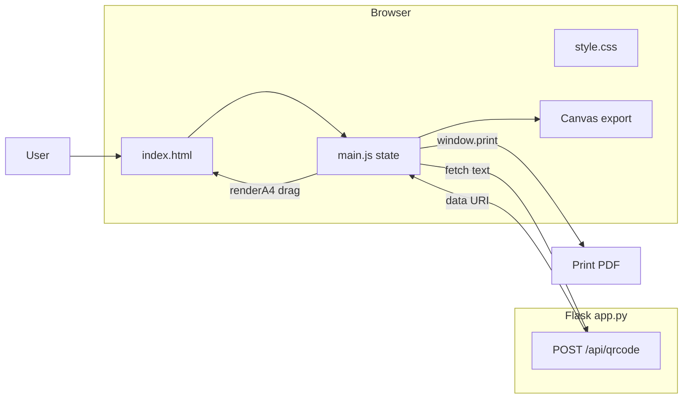
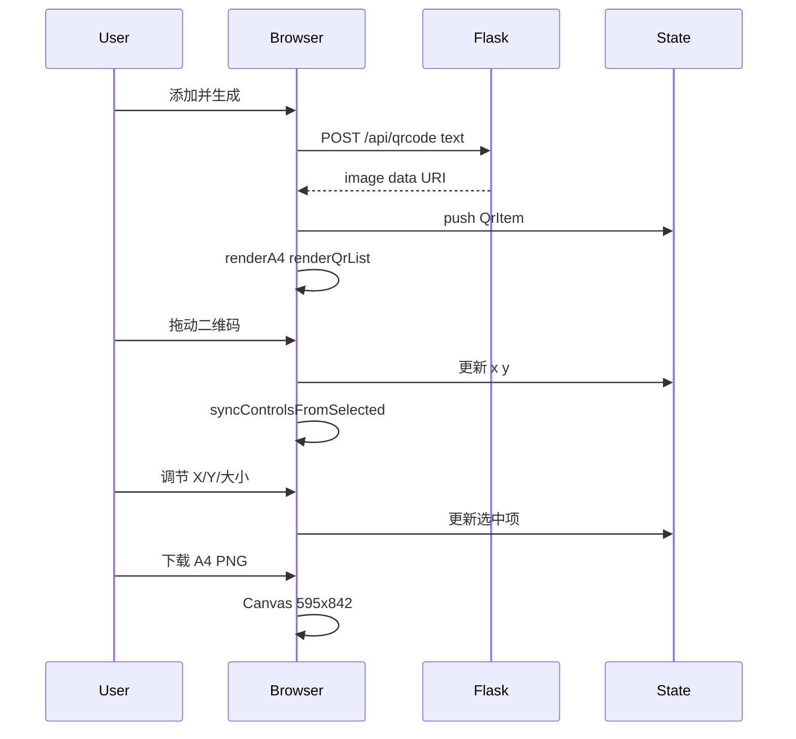

# QR Paper Studio

**纸上码工坊** — 在浏览器里排版多个二维码到一张 A4 纸上，支持拖拽与精确坐标调节，导出整页 PNG 或打印。


---

## 功能特性

- 单页 A4 最多 **12** 个二维码，每个独立调节大小与坐标
- **鼠标拖拽**移动位置，与 X/Y 数字框双向同步
- 列表 + 预览区点击选中当前码
- **下载整张 A4 PNG**（595×842）
- 浏览器 **打印 A4**（可另存为 PDF）
- 单文件 Flask 后端 + 原生前端，代码含中文注释与学习向文档

## 系统架构概览



| 模块 | 文件 | 职责 |
|------|------|------|
| 页面结构 | `templates/index.html` | 输入区、A4 预览容器、布局控件 |
| 交互与状态 | `static/js/main.js` | `state.items`、渲染、拖拽、导出 |
| 样式与打印 | `static/css/style.css` | 布局、选中态、`@media print` |
| 二维码生成 | `app.py` | `POST /api/qrcode` → base64 图片 |

## 技术栈

| 层级 | 技术 |
|------|------|
| 后端 | Python、Flask |
| 二维码 | qrcode、Pillow |
| 前端 | HTML、CSS、JavaScript（状态驱动 UI、指针拖拽、Canvas） |

## 快速开始

```bash
git clone <你的仓库地址>
cd "QR Paper Studio"

python -m venv .venv
.\.venv\Scripts\Activate.ps1

pip install -r requirements.txt
python app.py
```

浏览器打开：**http://127.0.0.1:5000/**

## 使用说明

1. 输入内容，点击 **添加并生成**（或 `Ctrl + Enter`）
2. 在 A4 预览区 **拖动** 二维码改位置，或选中后用 **大小 / X / Y** 微调
3. 左侧列表可切换当前选中的码
4. **删除选中**、**下载 A4 PNG**、**打印 A4**

## 架构与请求流程



## 学习路径（推荐新手阅读）

这是我自学时从「单码」演进到「多码 + 拖拽」的记录，便于对照仓库历史或代码注释。

### 阶段 1：一个页面 + 一个 API

输入文字 → `POST /api/qrcode` → 显示一张图。后端 [app.py](app.py) 只负责生成 data URI，前端只负责展示。

### 阶段 2：`state.items` 数组

一张 A4 多个码 → 用数组保存每条记录（文字、图片、x、y、size），`renderA4()` 根据数组画 DOM。

### 阶段 3：选中态 + 控件

`selectedId` 决定滑块改哪一个；列表与预览区点击调用 `selectQr(id)`。

### 阶段 4：拖拽

`mousedown` 记录偏移，`document.mousemove` 更新坐标并 `clampPosition` 限制在纸内；与 X/Y 输入框共用同一份 state，导出/打印自然一致。

### 阶段 5：Canvas 与打印

- 打印：`window.print()` + CSS 隐藏操作区
- 下载：Canvas 按 state 坐标绘制，得到与预览一致的 PNG

### 术语速查

| 术语 | 含义 |
|------|------|
| 路由 | URL 对应后端函数，如 `/api/qrcode` |
| POST | 提交 JSON 的请求方式 |
| data URI | 内联图片字符串，赋给 `` |
| state 驱动 UI | 先改数据，再 render 或更新 DOM |
| async / await | 异步请求，等待接口返回 |

## 面试介绍参考

下面是一套可直接练习的讲法，按你面试时长裁剪。

### 30 秒版

> 这是我做的 **QR Paper Studio（纸上码工坊）**，一个本地 Web 小工具：在 A4 预览上排版多个二维码，可拖拽调位置，也能导出 PNG 或打印。  
> 后端用 **Python + Flask** 提供一个生成二维码的 POST 接口；前端用 **原生 HTML/CSS/JS**，用 **state 数组** 管理多个码的位置，用 **Canvas** 做整页导出。是我自学前后端时练手做的全栈项目。

### 2 分钟版（建议按层讲）

**1. 业务**  
解决「多张二维码要打在一张 A4 上、位置要可调」的问题，面向打印场景，不是单纯在线生成一个码。

**2. 后端（app.py）**  
- Flask 两个入口：`GET /` 返回页面，`POST /api/qrcode` 接收文字，用 `qrcode` 库生成 PNG，转 **base64 data URI** 返回 JSON。  
- 故意不做批量 API：学习阶段保持接口简单，多码由前端多次调用。

**3. 前端（main.js）**  
- **状态**：`state.items` 存每个码的内容与布局；`selectedId` 表示当前编辑对象。  
- **渲染**：`renderA4` 根据 state 创建多个绝对定位的 `.qr-box`。  
- **交互**：指针拖拽更新 x/y，并钳制在 595×842 的 A4 内；滑块与数字框双向同步。  
- **导出**：Canvas 按同一套坐标绘制白底 + 所有码；打印用 `@media print` 隐藏工具栏。

**4. 技术选型说明**  
未使用 React/Vue，为了看清 DOM 与状态的关系；适合作为初学者项目，但架构上仍是清晰的前后端分离。

### 可主动提到的亮点

- 前后端职责清晰：后端只生成图，排版全在前端。  
- 拖拽与表单控件共用 state，避免预览与导出不一致。  
- 打印（矢量排版）与 PNG 下载（位图合成）两条导出路径。

### 常见追问（准备一句答法）

| 问题 | 答法要点 |
|------|----------|
| 为什么用 POST 不用 GET？ | 要提交较长文本，且不应出现在 URL 里 |
| data URI 是什么？ | 把图片编成字符串，前端可直接显示，无需再存文件 |
| async/await 干什么？ | 等 `/api/qrcode` 返回后再更新页面，不卡死界面 |
| 怎么扩展批量生成？ | 增加 `POST /api/qrcode/batch` 或在后端循环调用现有逻辑 |
| 拖拽怎么实现？ | mousedown 记偏移，document 级 mousemove 更新 state 再改 style |

## 项目结构

```
QR Paper Studio/
├── app.py
├── requirements.txt
├── templates/index.html
├── static/
│   ├── css/style.css
│   └── js/main.js
└── README.md
```

## API 说明

| 方法 | 路径 | 说明 |
|------|------|------|
| GET | `/` | 编辑器页面 |
| POST | `/api/qrcode` | `{"text":"..."}` → `{"image":"data:image/png;base64,..."}` |

## 开发说明

- 前端改动刷新浏览器；`debug=True` 时改 `app.py` 自动重载  
- 提交：`feat:` 功能 · `fix:` 修复 · `docs:` 文档

## License

MIT
