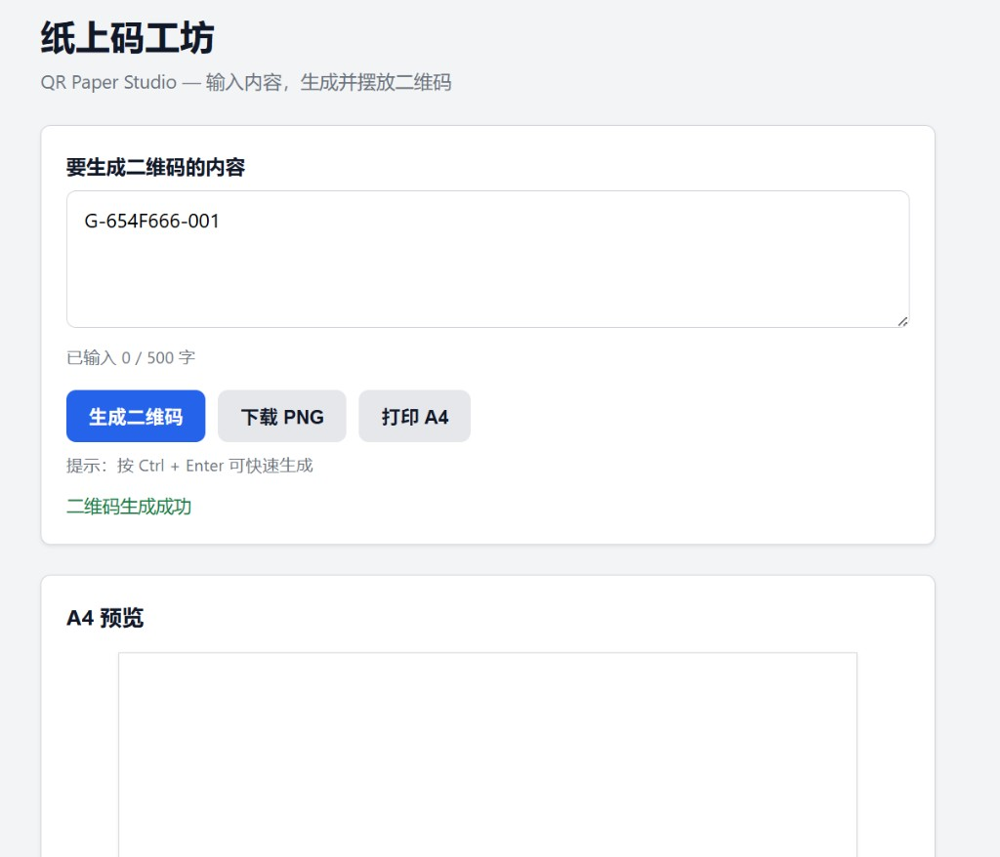
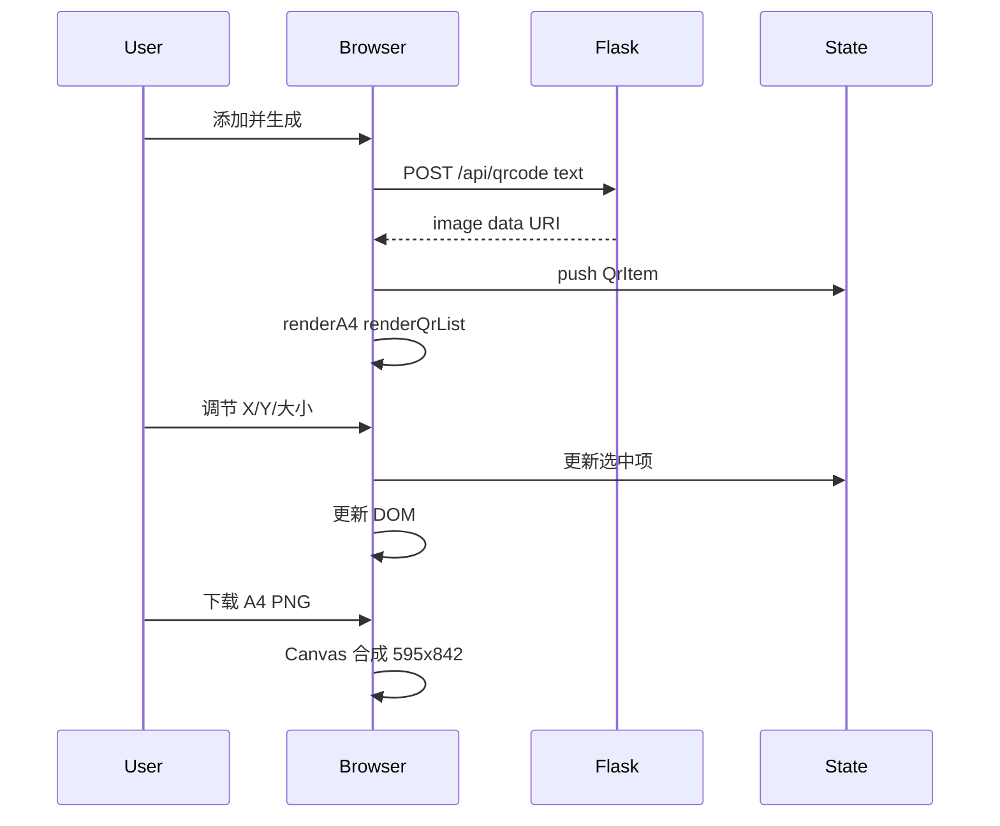

# QR Paper Studio

**纸上码工坊** — 在浏览器里排版多个二维码到一张 A4 纸上，调节各自位置与大小，并导出整页 PNG 或打印。


---

## 功能特性

- 单页 A4 上添加**多个**二维码（最多 12 个），每个独立调节大小与坐标
- 列表 + 预览区点击选中，实时同步布局控件
- **下载整张 A4 PNG**（595×842，与预览一致）
- 浏览器 **打印 A4**（可另存为 PDF）
- 单文件 Flask 后端 + 原生前端，适合自学 Web 全栈

## 效果预览



> 实现多码布局后，建议用新界面截图覆盖 `docs/preview.png`，再 `git add` 一并提交。

## 技术栈

| 层级 | 技术 |
|------|------|
| 后端 | Python、Flask |
| 二维码 | qrcode、Pillow |
| 前端 | HTML、CSS、JavaScript（状态驱动 UI、Canvas 导出） |

## 快速开始

```bash
git clone <你的仓库地址>
cd "QR Paper Studio"

python -m venv .venv
.\.venv\Scripts\Activate.ps1   # Windows PowerShell

pip install -r requirements.txt
python app.py
```

浏览器打开：**http://127.0.0.1:5000/**

## 使用说明

1. 输入内容，点击 **添加并生成**（或 `Ctrl + Enter`）
2. 重复添加可在一张 A4 上排多个码；左侧列表或预览区点击 **选中** 某一个
3. 用 **大小 / X / Y** 调节当前选中二维码
4. **删除选中** 移除当前码
5. **下载 A4 PNG** 导出整页；**打印 A4** 使用系统打印对话框

## 学习路径（推荐新手阅读）

这是我自学时把项目从「一个码」做到「一张纸多个码」的演进记录，方便你对照代码理解**为什么**要这样设计。

### 阶段 1：一个页面 + 一个 API

最初版本只做一件事：输入文字 → `POST /api/qrcode` → 在页面上显示一张二维码。  
后端 [app.py](app.py) 负责生成图片（base64 data URI），前端只负责展示。  
这时 HTML 里可以写死一个 ``，不需要复杂状态。

### 阶段 2：从 1 个 DOM 到 `state.items` 数组

要在一张 A4 上放多个码，就不能只操作一个 `#qrImage` 了。  
我在 [static/js/main.js](static/js/main.js) 里引入：

```javascript
const state = { items: [], selectedId: null };
```

每个二维码是一条记录（文字、图片、x、y、size）。**页面长什么样，由这份数据决定**——这叫状态驱动 UI。

### 阶段 3：选中态 + 控件只改一项

多个码并存时，滑块应该只改「当前选中的那个」。  
于是增加 `selectedId`，点击预览区或列表 → `selectQr(id)` → 控件读/写对应项。  
这是前端里很常见的模式：**先改数据，再 render 或局部更新 DOM**。

### 阶段 4：Canvas 导出整页 vs `window.print`

- **打印**：`window.print()` + CSS `@media print`，由浏览器按 A4 排版，适合「另存为 PDF」。
- **下载 PNG**：用 Canvas 按 595×842 把白底和所有码画在一起，得到与预览一致的位图文件。  
  两者职责不同：打印走系统对话框；下载走像素合成。

### 为何不做 batch API？

多码时前端对每个内容各调一次 `POST /api/qrcode`。  
批量接口能减少请求次数，但对学习来说，单码 API 更简单、也足够用；README 与代码保持这一设计选择。

### 术语速查

| 术语 | 含义 |
|------|------|
| 路由 | URL 路径对应到某段后端函数，如 `/api/qrcode` |
| POST | HTTP 方法，用于提交 JSON 数据（不是地址栏 GET） |
| JSON | 前后端交换数据的文本格式 |
| base64 / data URI | 把图片编成字符串，可直接赋给 `` |
| async / await | 发请求时等待结果，不阻塞整个页面 |

## 架构与请求流程



## 项目结构

```
QR Paper Studio/
├── app.py                 # Flask：首页 + POST /api/qrcode
├── requirements.txt
├── docs/preview.png       # README 预览图
├── templates/index.html   # 编辑器页面结构
├── static/
│   ├── css/style.css      # 布局、选中态、打印样式
│   └── js/main.js         # 多码 state、渲染、导出
└── README.md
```

## API 说明

| 方法 | 路径 | 说明 |
|------|------|------|
| GET | `/` | 返回编辑器页面 |
| POST | `/api/qrcode` | Body: `{"text":"..."}` → `{"image":"data:image/png;base64,..."}` |

地址栏直接打开 `/api/qrcode` 会失败（仅支持 POST），请通过页面按钮调用。

## 开发说明

- 前端改动：刷新浏览器；`debug=True` 时改 `app.py` 自动重载
- 提交规范：`feat:` 功能 · `fix:` 修复 · `docs:` 文档

## License

MIT
